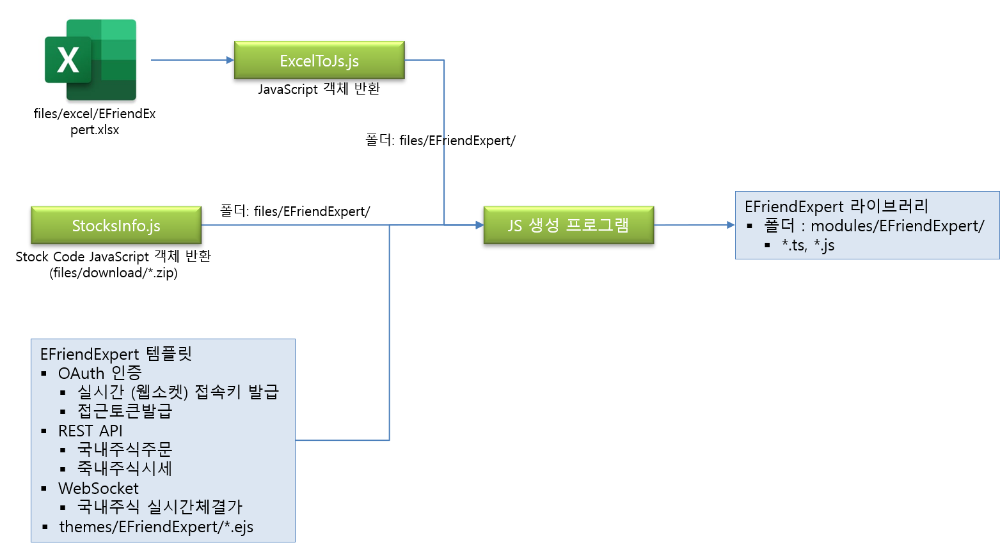

# 한국투자증권 Node.js 라이브러리

## 소개

  

### 프로젝트의 시작 동기

   

대한민국에서 최초로 한국투자증권이 REST API 형태로 API를 제공 합니다.

(다른 증권사는 OCX, COM, DLL 등의 방식으로 제공 합니다.)

  

한국투자증권에서 제공하는 Sample 라이브러리는 Python으로 되어 있는데 이도 완전하지 않습니다.

  

[한국투자증권의 KIS Developers API](https://apiportal.koreainvestment.com/apiservice/)를 사용할 수 있는 Node.js 라이브러리가 없습니다.

  

Web에서 한국투자증권의 API를 사용하여

**자동매매** 서비스를 구현하기 위해서 Node.js 라이브러리가 필요 합니다.

[한국투자증권의 KIS Developers API](https://apiportal.koreainvestment.com/apiservice/)를 사용하는 Node.js 라이브러리를 제작 합니다.

   

[한국투자증권의 KIS Developers API](https://apiportal.koreainvestment.com/apiservice/)를 사용하여 자동매매를 구현하고자 하는 사용자 대상 입니다.

 

### 회의 진행/모임 방식 

   

- 1주일에 1회 정기적으로 회의 합니다.
- Zoom을 사용하여 온라인 회의를 진행 합니다.

   

### 그외 자유기재 

  

Node.js를 사용하여 개발할 수 있는 기획자와 개발자를 모집 합니다.

  

분석/설계 이후 [한국투자증권의 KIS Developers API](https://apiportal.koreainvestment.com/apiservice/)를 사용한 Node.js 라이브러리 제작 작업은 단순한 반복 작업이 될 수 있습니다.

Node.js 경험이 있거나 라이브러리 설계 경험이 있으신 분은 지원해 주세요.

  

## 프로젝트 범위와 단계

> 1차 완료 목표는 1단계와 2단계 입니다.

  

- 1 단계
  -   아래 사이트를 참조하여 Excel 문서 작성
  - [한국투자증권의 KIS Developers API](https://apiportal.koreainvestment.com/apiservice/)

- 2 단계
  - Excel 문서로 Node.js 라이브러리 생성
    -   자동 생성 프로그램 제작. Excel to JavaScript
  -   Node.js로 한국투자증권의 API를 사용할 수 있어야 한다.

- 3 단계 : Reserved
  - API에 사용에 필요한 편의 기능 제작
    -   사용자 관리, 계정 관리, Cluster와 Session 관리 등 (협의 후 확정 필요)
  -   Swagger로 Open API 명세서 제작 (필요시)

-   4 단계 : Reserved
    -   투자 자동화 지원 기능 제작
    -   증권 데이터 수집
    -   시각화 : [Trading View](https://kr.tradingview.com/chart/) 등 참조
    -   투자 정책 발굴과 적용

  

## 개발 환경

> 협의 후 확정 필요
> 현재 제가 생각하는 사항을 명시 하였습니다.
> 각자 의견 주시면 조율 하겠습니다.  

  

-   개발 환경
    -   개발 방법론 : 후보 - Scrum
    -   커뮤니케이션 : 후보 - Slack, Zoom / 렛플, Notion
        -   [Discord](https://discord.com/)
        -   카톡, 이메일
        -   Zoom
    -   개발 언어
        -   [TypeScript](https://www.npmjs.com/package/typescript)
        -   JavaScript
    -   소스 관리
        -   GitHub
        -   Git Service
    -   테스트
        -   Mocha with Chai, Sinon
        -   [Mocha](https://mochajs.org/) : Test Framework
        -   [Chai](https://www.chaijs.com/) : Assertion library
        -   [Sinon](https://sinonjs.org/) : Test double
        -   [istanbul](https://istanbul.js.org/) : Code Coverage
        -   [Vitest](https://vitest.dev/) : Unit Test Framework
    -   Software (필요시)
        -   Nginx
        -   Node.js
        -   데이터베이스 : SQLite, MariaDB 또는 MongoDB
        -   캐쉬 : Redis
        -   MQTT : Mosquitto
        -   OS : CentOS in Daou Cloud 또는 KT Cloud 또는 AWS
        -   알림
            -   Email : Google 메일
                -   후보 - Naver 메일, Daum 메일, Nate 메일, Cafe24 메일 등
            -   SMS : [알리고](https://smartsms.aligo.in/admin/api/spec.html)
            -   Telegram

​    

## 일정과 계획

  

### 작업

  

  

- 1단계와 2단계 완료를 위해 필요한 작업
  - EFriendExpert.xlsx 문서 완성
    - [한국투자증권의 KIS Developers API](https://apiportal.koreainvestment.com/apiservice/) 내용을 Excel로 재작성한 파일
  - Excel을 읽어서 JavaScript 객체를 제작하는 프로그램
    - [exceljs](https://www.npmjs.com/package/exceljs) Package 추천 : Excel 읽기
  - 종목 코드 가져오는 프로그램
    - [decompress](https://www.npmjs.com/package/decompress) Package 추천 : zip 파일 압축 해제
    - [iconv-lite](https://www.npmjs.com/package/iconv-lite) Package 추천 : 문자셋 변경 (UTF-8, EUC-KR)
  - JavaScript 객체를 읽어서 Node.js용 한국투자증권 API를 제작하는 프로그램
    - [node-fetch](https://www.npmjs.com/package/node-fetch) Package 추천 : REST API
    - [ws](https://www.npmjs.com/package/ws) Package 추천 : WebSocket
    - [crypto](https://www.npmjs.com/package/crypto) Package 추천 : 암복호화
    - [uuid](https://www.npmjs.com/package/uuid) Package 추천 : GUID 생성
    - [ejs](https://www.npmjs.com/package/ejs) Package 추천 : 템플릿 엔진
      - [pug](https://www.npmjs.com/package/pug)
      - [nunjucks](https://www.npmjs.com/package/nunjucks)
    - OAuth 인증
      - 실시간 (웹소켓) 접속키 발급
      - 접근토큰발급(P)
    - 국내주식주문
      - 주식주문(현금) : POST method를 REST API
    - 국내주식시세
      - 주식현재가 시세 : GET method를 사용하는 REST API
    - 실시간시세(국내주식)
      - 국내주식 실시간체결가 : WebSocket
  - 테스트 프로그램
  - 문서화 (협의후 확정 필요)
    - Markdown
    - Swagger
      - [swagger-ui-express](https://www.npmjs.com/package/swagger-ui-express) Package 추천
    - [JSDoc](https://www.npmjs.com/package/jsdoc)
- 3단계 완료를 위해 필요한 작업 : Reserved  (협의후 확정 필요)
  - 한국투자증권 Node.js 라이브러리 업그레이드
    - Cluster와 Session 관리 등
  - HTTPS로 제공되는 서비스
    - Cloud 서버
    - 도메인, 공인 IP, 서버 인증서
  - 사용자 관리
  - 한국투자증권 접속 계정 관리 등등
- 4단계 완료를 위해 필요한 작업 : Reserved  (협의후 확정 필요)
  - 증권 데이터 수집 기능 제작
  - 투자 자동화 지원 기능 제작
  - 시각화 : [Trading View](https://kr.tradingview.com/chart/) 추천
  - 투자 정책 발굴과 적용

​    

### 일정

- 3차 온라인 미팅
  - 2023년 6월 19일 월요일 오후 7시
  - 진행 사항 검토
  - Offline 미팅 방안 협의
- 2차 온라인 미팅
  - 2023년 6월 7일 오후 7시
  - 참석 : 김계현, 이연권, 김진겸
  - 업무 분장
    - 김계현 : OAuth 인증 샘플 프로그램 제작
    - 이연권 : Excel을 JavaScript로 반환하는 프로그램 제작
    - 김진겸 : WebSocket 샘플 프로그램 제작
  - Code Convention
    - ESLint 사용
    - Prettier 사용
  - Git Convention
    - 형상 관리를 위한 branch 전략
      -  master : 제품으로 출시될 수 있는 브랜치
      - develop : 다음 출시 버전을 개발하는 브랜치
      - feature : 기능을 개발하는 브랜치
      - release : 이번 출시 버전을 준비하는 브랜치
      - hotfix : 출시 버전에서 발생한 버그를 수정 하는 브랜치
    - Merge Request  >  동료 Review  >  Merge
    - Commit message 규칙
      - [Type] commit message
      - type
        - feature : 새로운 기능 추가
        - fix : 버그 수정
        - docs : 문서 업데이트
        - style : frontend의 style 수정
        - refactor : 코드의 리팩토링
        - test : 테스트코드 업데이트
        - env : 환경 구축
  - Code review
    - Code review는 offline에서는 review 문서 작성하여 전달
  - 커뮤니케이션
    - [Discord](https://discord.com/) 사용
- 1차 온라인 미팅
  - 2023년 5월 30일 오후 7시
  - 작업 계획
    - EFriendExpert.xlsx 문서 작성
    - 작업 환경 구성

​    

  